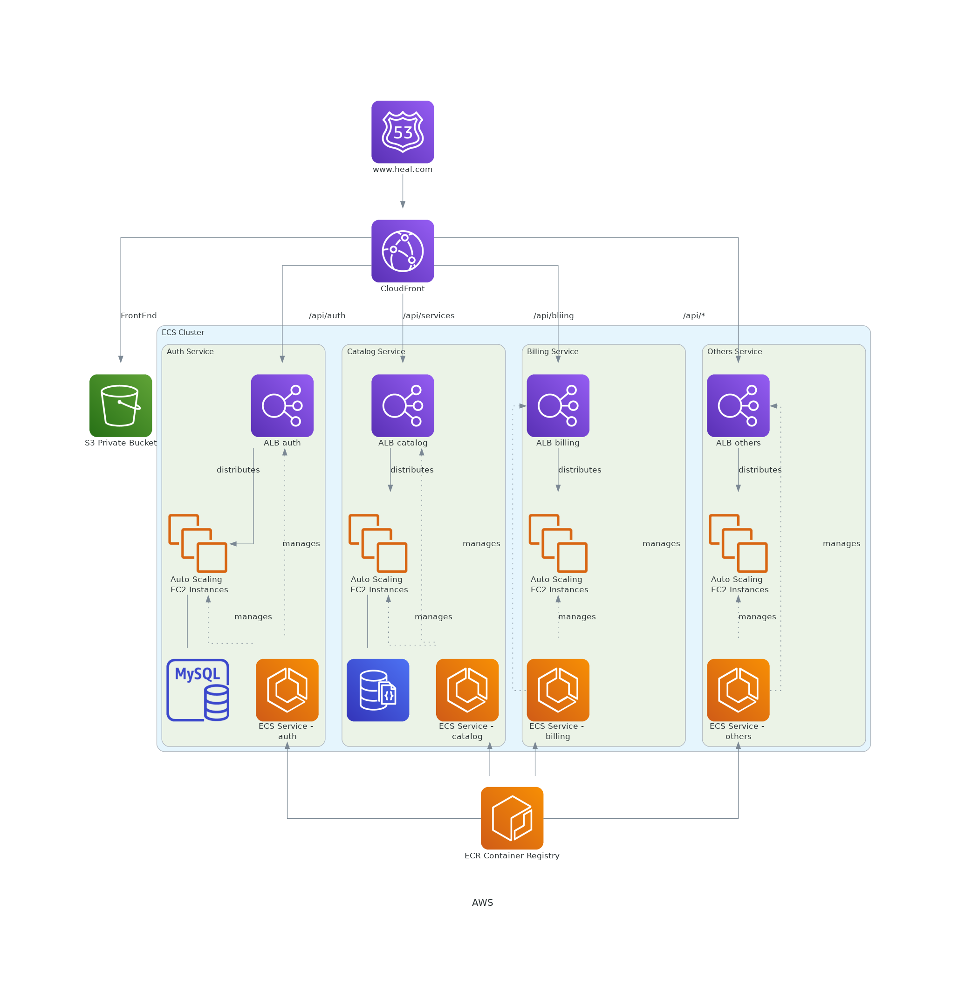
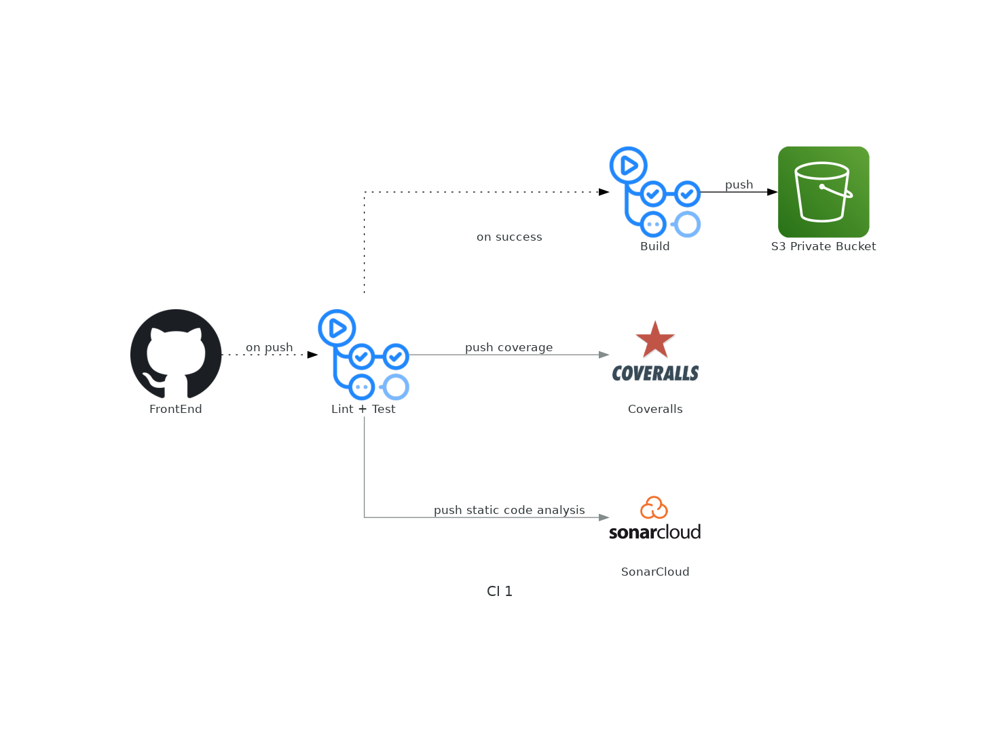
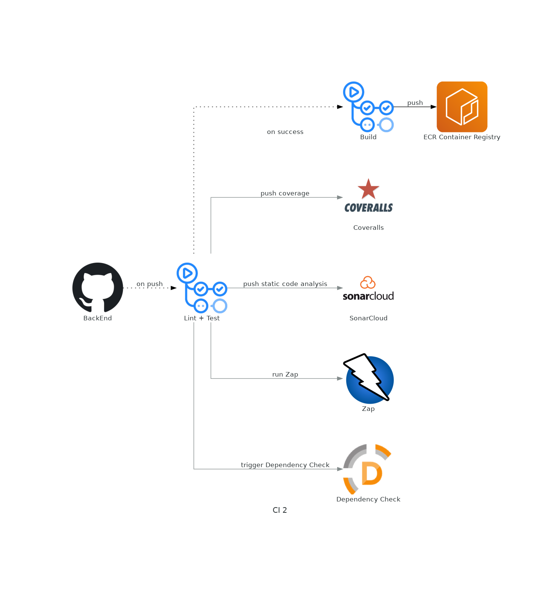

# Infrastructure

0. Make sure to clone all other repos

1. Change variables in `Docker-compose.dev.yml` based on other repos

2. 

**API only**
```bash
podman-compose -f Docker-compose.dev.yml up api --build -d


podman-compose -f Docker-compose.dev.yml down api
```

**Whole Application**
```bash
podman-compose -f Docker-compose.dev.yml up --build -d


podman-compose -f Docker-compose.dev.yml down
```
**Container logs**
```bash
podman logs --follow infra_api
podman logs --follow infra_web
```

---

### Architecture










